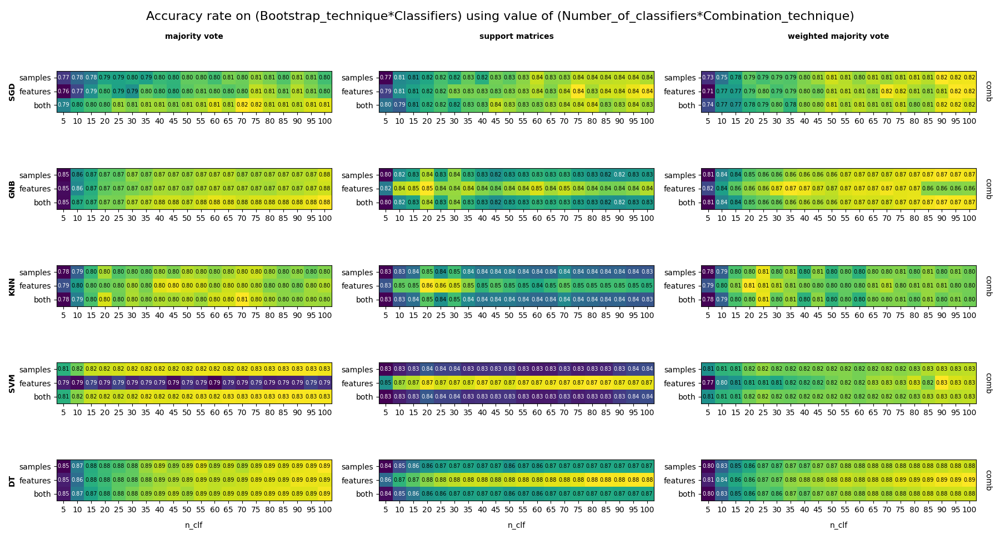

# ml_Project
Simple project with my own version of bagging and model to execute it. I already did some testing and have result files with AccuracyRate.
Statistical test are in progress, but will be done in near future.

# Heatmap of example results

